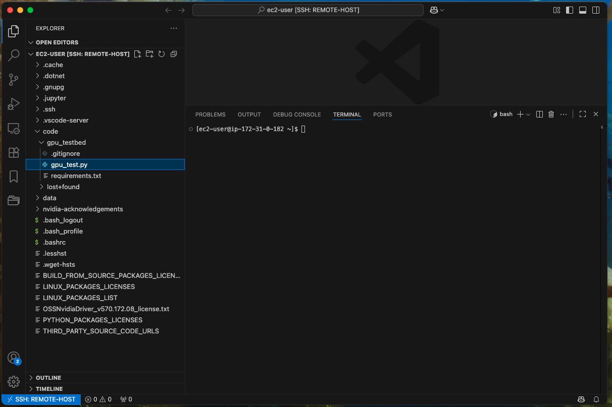
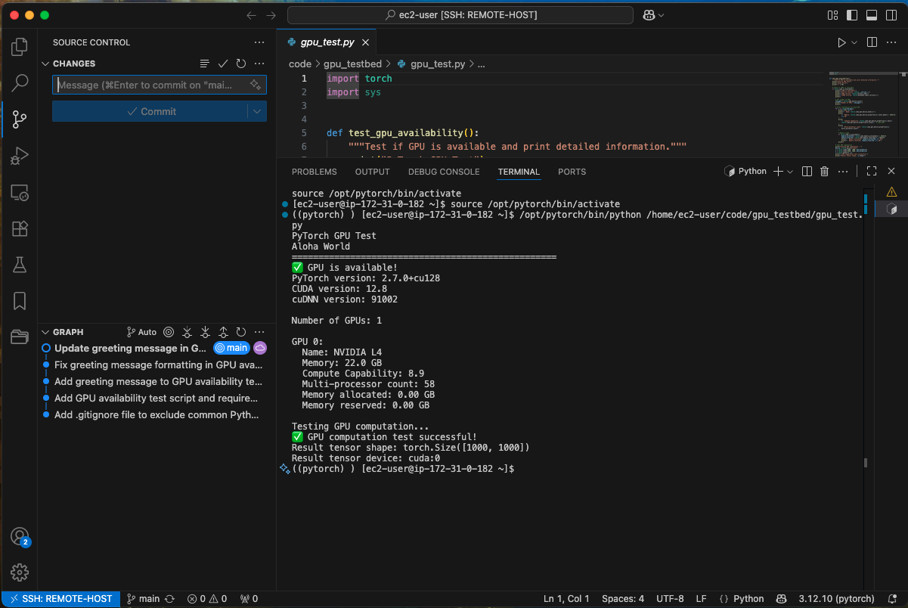
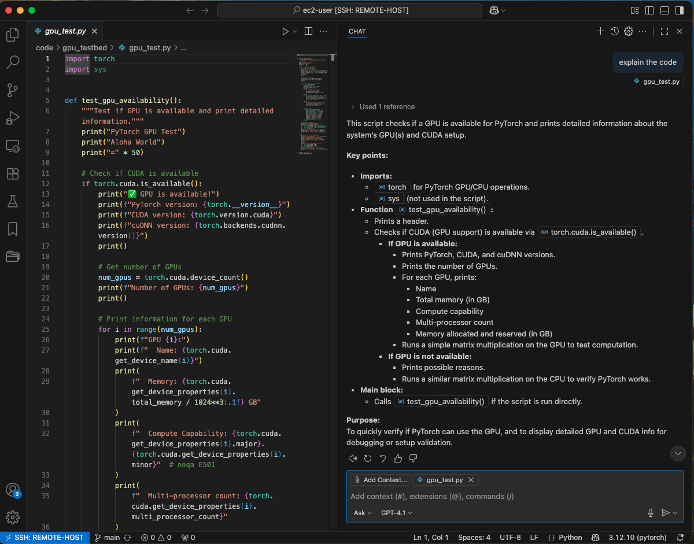

# Illustration of VSCode Remote Development with AWS


## AWS Automation Example

### YAML Specification

```yaml
# Example YAML specification
#   Starting a GPU instance 
#   installing required software
#   cloning git repository from GitHub

instances:
  - name: "gpu-instance"
    instance_type: "g6.2xlarge" #"t3.xlarge"
    ami_id: "ami-09ddf6b7d718bc247"  # deep learning
    market_type: "on-demand"
    key_name: "MY-KEY-PAIR-PLACEHOLDER"  # Support SSH Connection 
    security_groups:  # Security Group IDs
      - "sg-SECURITY-GROUP-ID-PLACEHOLDER"
    subnet_id: "subnet-SUBNET-ID-PLACEHOLDER"  # Subnet ID
    iam_role: "EC2-IAM-ROLE-PLACEHOLDER"  # Support retrieving SSM parameters
    user_data:
      inline_script: |
        #!/bin/bash

        echo "starting server setup"

        # update system sofware
        yum update -y
        yum install --allowerasing -y  htop curl wget gnupg2 pinentry

        sudo -iu ec2-user bash << EOF
            repo_name="gpu_testbed"
            repo_dir=~/\${repo_name}
            git_user="Jim Thompson"
            git_email="EMAIL-ADDRESS"

            # Configure GPG
            echo "Configuring GPG..."
            mkdir -p ~/.gnupg
            chmod 700 ~/.gnupg
            echo "use-agent" >> ~/.gnupg/gpg.conf
            echo "pinentry-mode loopback" >> ~/.gnupg/gpg.conf

            # get gpg keys and key id from AWS SSM Parameter Store
            aws ssm get-parameter --name "/PARAMETER/SECRET-GPG-KEY" --with-decryption --query "Parameter.Value" --output text | gpg --import

            aws ssm get-parameter --name "/PARAMETER/GITHUB-GPG-PUBLIC-KEY" --with-decryption --query "Parameter.Value" --output text | gpg --import

            GPG_KEY_ID=$(aws ssm get-parameter --name "/PARAMETER/GITHUB-GPG-KEY-ID" --with-decryption --query "Parameter.Value" --output text)

            # Start gpg-agent
            gpg-agent --daemon --default-cache-ttl 3600


            echo "Checking if repository \${repo_dir} exists..."
            if [ ! -d "\${repo_dir}" ]; then
                echo "Cloning repository in \${repo_dir}"
                git clone "https://github.com/jimthompson5802/\${repo_name}.git"
                cd \${repo_dir}
                echo "Setting git user configuration for \${git_user} with \${git_email}"
                git config user.name "\${git_user}"
                git config user.email "\${git_email}"
                git config user.signingkey "\${GPG_KEY_ID}"
                git config commit.gpgsign true
                git config tag.gpgsign true
            else
                echo "\${repo_dir} already exists, skipping clone"
            fi
        EOF

        echo "Server setup completed!"

    # CloudWatch idle shutdown configuration
    idle_shutdown:
      cpu_threshold: 5.0          # Stop when CPU < 5% 
      evaluation_minutes: 30       # For 30 minutes continuously
      action: "terminate"               # Action: "stop" or "terminate"
    tags:  # Optional: Custom tags
      - Key: "Environment"
        Value: "testing"
    volumes:  # Optional: Additional EBS volumes
      - size: 50
        type: "gp3"
        device: "/dev/sdf"
        encrypted: true
```

### Create AWS Resources
```bash
python script.py --spec setup/gpu_setup.yaml --profile ec2-user create

# OUTPUT
2025-08-31 08:25:02,026 - INFO - Loaded specification from setup/gpu_setup.yaml
2025-08-31 08:25:02,026 - INFO - Specification validation passed
2025-08-31 08:25:02,026 - INFO - Starting resource provisioning...
2025-08-31 08:25:02,245 - INFO - Using inline user data script
2025-08-31 08:25:02,245 - INFO - Added user data script to instance gpu-instance
2025-08-31 08:25:02,245 - INFO - Added IAM instance profile EC2-IAM-ROLE-PLACEHOLDER to instance gpu-instance
2025-08-31 08:25:03,510 - INFO - Created EC2 instance: i-EC2-INSTANCE-ID (gpu-instance)
2025-08-31 08:25:03,511 - INFO - Waiting for instance i-EC2-INSTANCE-ID to be running...
2025-08-31 08:25:14,384 - INFO - Created EBS volume: vol-EBS-VOLUME-ID
2025-08-31 08:25:20,339 - INFO - Attached volume vol-EBS-VOLUME-ID to instance i-EC2-INSTANCE-ID at /dev/sdf
2025-08-31 08:25:20,626 - INFO - Created CloudWatch alarm: idle-shutdown-gpu-instance-i-EC2-INSTANCE-ID for instance i-EC2-INSTANCE-ID
2025-08-31 08:25:20,721 - INFO - Retrieved connection information for 1 instances
2025-08-31 08:25:20,722 - INFO - Resource provisioning completed successfully
Successfully created resources: {'instances': ['i-EC2-INSTANCE-ID'], 'volumes': ['vol-EBS-VOLUME-ID'], 'alarms': ['idle-shutdown-gpu-instance-i-EC2-INSTANCE-ID'], 'connection_info': [{'instance_id': 'i-EC2-INSTANCE-ID', 'name': 'gpu-instance', 'public_ip': 'PUBLIC-IP-ADDRESS', 'state': 'running'}]}

============================================================
INSTANCE CONNECTION INFORMATION
============================================================
Instance Name: gpu-instance
Instance ID: i-EC2-INSTANCE-ID
Public IP Address: PUBLIC-IP-ADDRESS
State: running
SSH Command: ssh -i <your-key.pem> ec2-user@PUBLIC-IP-ADDRESS
------------------------------------------------------------

Instances with user data scripts detected.
You can monitor user data execution with:
python script.py monitor --spec setup/gpu_setup.yaml --region AWS-REGION-ID --profile ec2-user

Instances with idle shutdown alarms detected.
You can monitor CloudWatch alarms with:
python script.py monitor-alarms --spec setup/gpu_setup.yaml --region AWS-REGION-ID --profile ec2-user
```
### Devevelopment Environment Diagram


### Example Usage
#### Remote Connection Setup


#### Remote Connection Setup


#### Remote Connection Configuration


#### Remote Host Environment


#### VSCode Extensions on Remote


#### nVidia SMI Command Output


#### Sample Pytorch Program
 

#### Sample Pytorch Program Execution


#### VSCode Git Integration


#### Github Copilot Chat


#### Github Copilot Autocomplete


### Shutdown AWS Resources
```bash
python script.py --spec setup/gpu_setup.yaml --profile ec2-user delete

# OUTPUT
2025-08-31 08:29:43,567 - INFO - Specification validation passed
2025-08-31 08:29:43,567 - INFO - Starting resource deletion...
2025-08-31 08:29:44,427 - INFO - Deleted CloudWatch alarms: ['idle-shutdown-gpu-instance-i-EC2-INSTANCE-ID']
2025-08-31 08:29:44,898 - INFO - Terminated instances: ['i-EC2-INSTANCE-ID']
2025-08-31 08:36:50,049 - INFO - Resource deletion completed
Successfully deleted resources
```